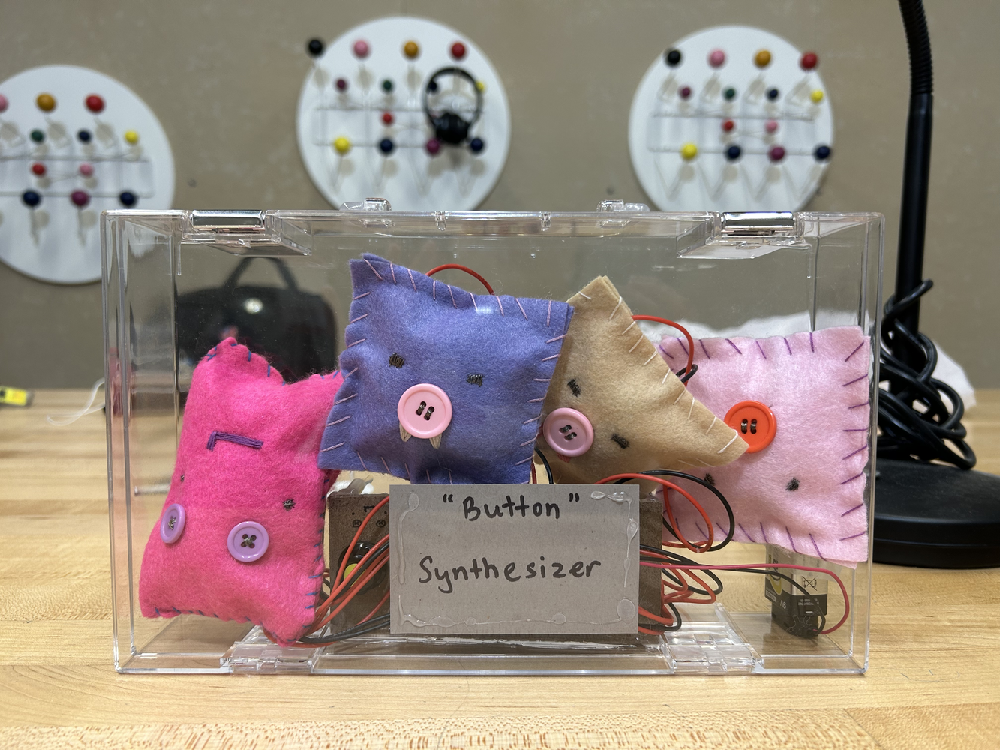
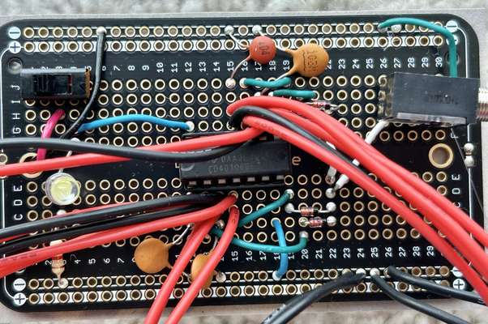
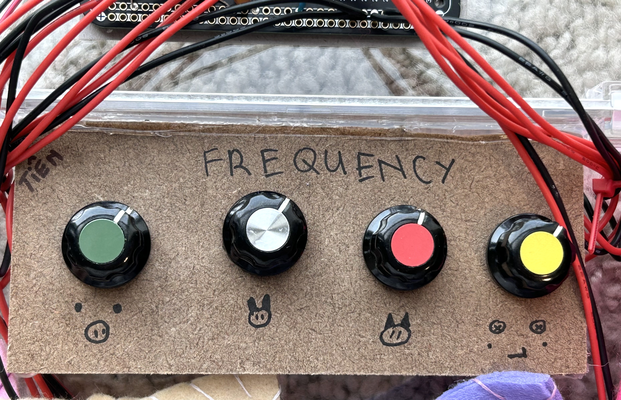

## "BUTTON" SYNTHESIZER
  

  
**Project Description:** "Button" synthesizer is an instrument that allows you to modify pitch by tapping on the cushion. The buttons are sewn with conductive thread.
Your skin is considered a variable resistor, therefore, by making a connection between the threads, you are changing the pitch of each potentiometer/knob.
The cushions are hand-sewn by me with different characters. All components including the circuit board, the pitch control board, the battery, and the 4 cushions are stored in a clear case with a handle.
  
Additional photos of the design and the circuit board:
  

  
**Demonstration:** [Click here](https://drive.google.com/file/d/1bfHL5FGjcFILCOO_uVvkqVHRVZypXYwI/view?usp=sharing) to watch the demonstration video.
