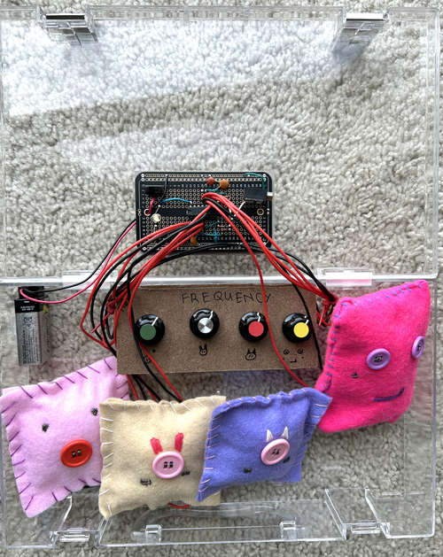

## "BUTTON" SYNTHESIZER
  

  
**Project Description:**
 
The "Button" synthesizer is an instrument that allows you to modify the pitch by tapping on its cushioned surface. The buttons are stitched with conductive thread. 

Your skin acts as a variable resistor; by creating a connection between the threads, you can change the pitch for each potentiometer or knob.

I hand-sew the cushions with various characters. All components, including the circuit board, pitch control board, battery, and four cushions, are stored in a clear case with a handle for easy transport.
  
Here are some additional photos showcasing the design and the circuit board:
  

  
**Demonstration:** [Click here](https://drive.google.com/file/d/1bfHL5FGjcFILCOO_uVvkqVHRVZypXYwI/view?usp=sharing) to watch the demonstration video.
