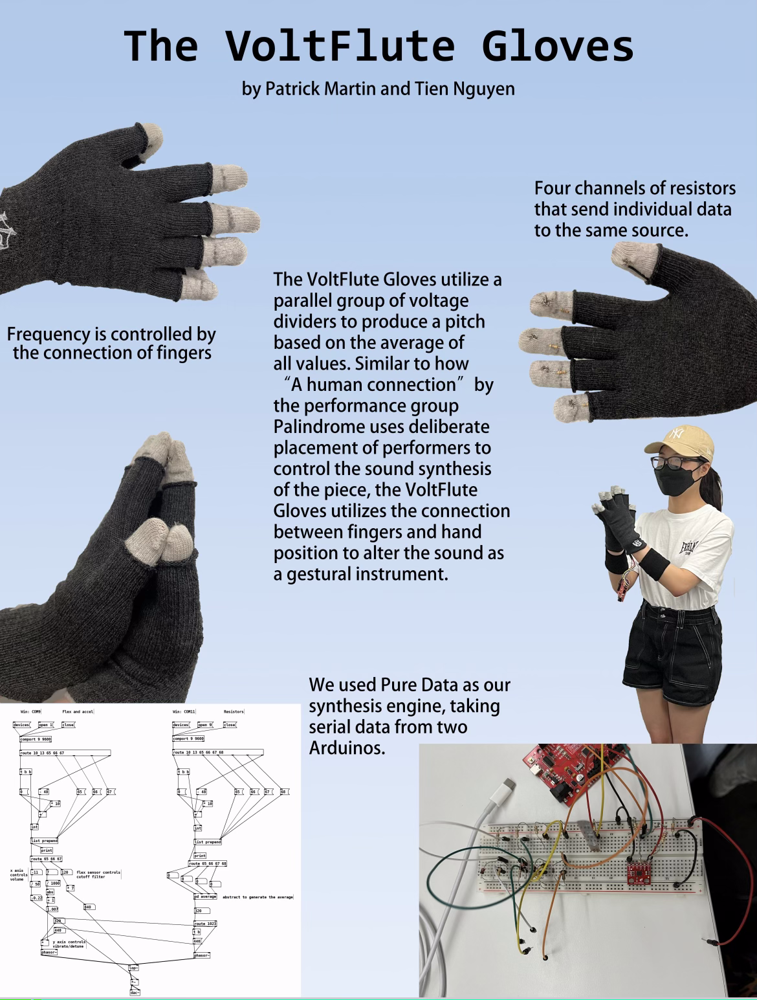

## THE VOLTFLUTE GLOVES (by Tien Nguyen and Patrick Martin)

**Project description:** This is a project that is focused on sound and movement. The gloves act like a controller making use of three interactions: touch, flex, and motion. For the touch aspect, we have a set of different resistors with different values, which are fed into an Arduino (we used [SparkFun RedBoard Plus](https://www.sparkfun.com/products/18158?gclid=CjwKCAiAoL6eBhA3EiwAXDom5o1pHBmLw4evZSg0s42MV4RDG1Incx7Id3NLVxjXL-zsDAnQutcWihoCsQsQAvD_BwE)), and then that serial data will go into [Pure Data](https://puredata.info/) our synthesis engine, which will assign a pitch for each data value. For the flex and motion aspect, the idea is pretty much the same, but the flex sensor (flex) will control the cutoff filter and the accelerometer (motion), which has X and Y axis, will control vibrato and volume respectively. The values then are fed into a different Arduino, but connect into the same computer.
  
The VoltFlute Gloves is an instrument that opens up a new way to create sounds and music with your hands.
  
This is a poster summerized the project that my partner Patrick made for The 8th International Conference on Movement and Computing (MOCO'22) at Columbia College Chicago.
  

 
### Demonstration
Watch the demonstration video [here](https://drive.google.com/file/d/1ZpX3eQfKFP_I_iwalWMx1skBHGPlXGj2/view?usp=sharing). Performed by Patrick Martin.

---
### References
Mi.MU Gloves by MI.MU GLOVES LIMITED. [Link](https://mimugloves.com/documentation/mimu-gloves-overview/).
 
"The Quarterstaff, a Gestural Sensor Instrument" by Jan C. Schacher. [Link](https://www.nime.org/2013/program/papers/day4/paper11/144/144_Paper.pdf).
 
_A human connection_, performed by Palindrome. [Link](https://vimeo.com/112230953).
