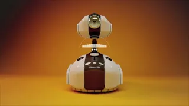
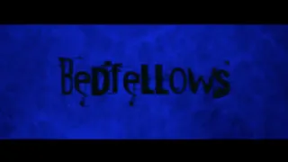

## PORTFOLIO

---

### Music Production Projects
'cHoke' by HLOWN
  
<iframe width="500" height="275" src="https://www.youtube.com/embed/B9VO835IgI8?si=N1gQy5xYO94G-NYK" title="YouTube video player" frameborder="0" allow="accelerometer; autoplay; clipboard-write; encrypted-media; gyroscope; picture-in-picture; web-share" referrerpolicy="strict-origin-when-cross-origin" allowfullscreen></iframe>
  
---
SOULBOT
  

 
[Soulbot (Sounds by Tien)](https://youtu.be/ltQaZAETpzY)
  
The "Soulbot" project is a sound design initiative for a commercial video titled "SoulBot." The music was created using Apple Live Loops and assembled in Logic Pro. Most of the sound effects were sourced from freesound.org. The entire project was edited using Pro Tools. The most challenging aspect of this project was ensuring that the sound effects of the robots' arms were synchronized with the video.
  
Reference:
"SoulBot" by Andreas Wannerstedt, _Vimeo_, [link](https://vimeo.com/25413547).

---
BEDFELLOWS
  

 
[Short Horror Film: Bedfellows (Music and Sounds by Tien)](https://youtu.be/qjXORN1yXfU)
  
This is my first sound design project. I composed the music using a keyboard plugin in Digital Performer. The voice actors were [Hayley Tran](https://www.linkedin.com/in/hayley-tran-342125186/), Taichi Kobayashi, and myself. It was recorded with a Tascam DR-40X portable recorder.
  
Reference:
""Bedfellows" - Award Winning Short Horror Film" by Kentleigh, _YouTube_, [link](https://www.youtube.com/watch?v=WQvGmMVBYMw&t=1s&ab_channel=Kentleigh).

---

### Music Tech Projects
[THE VOICE CHANGER MASK](/voicechanger_page.md) (Click to see details)

---
["BUTTON" SYNTHESIZER](/buttonsynth_page.md) (Click to see details)

---
[THE VOLTFLUTE GLOVES (by Tien Nguyen and Patrick Martin)](glovesynth_page.md) (Click to see details)

Page template forked from <a href="https://github.com/evanca/quick-portfolio">evanca</a>

<!-- Remove above link if you don't want to attibute -->
