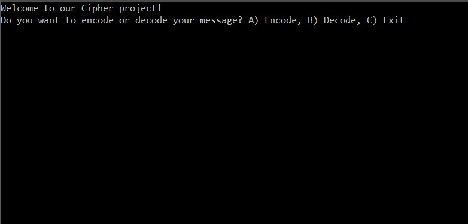
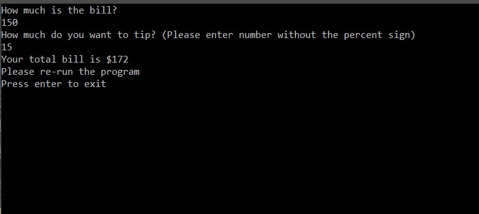

## Portfolio

---

### Programming Projects

Mystic Creatures
  

  
Mystic Creatures is a text-based adventure game written in C# coding language. The project demonstrates object-oriented programming principles inheritance, encapsulation, and polymorphism.
In *The World of Mystic Creatures*, you play an anonymous protagonist who accidentally fell off a cruise and got lost in the under-ocean world where there’s people and sea animals live harmoniously. You will face different challenges in order to go back home.

---
Cipher
  

  
Cipher is an application that encodes and decodes using a simple substitution cipher. The project demonstrates the use of conditional statements and iteration in C#.

---
Tip Calculator
  

  
A simple tip calculator that collects your bill and tip amount and calculate the total cost you have to pay. This project is a great example for exception handling, to make sure the program won't crash if the user enters wrong input type.

---

---

Page template forked from <a href="https://github.com/evanca/quick-portfolio">evanca</a>

<!-- Remove above link if you don't want to attibute -->
