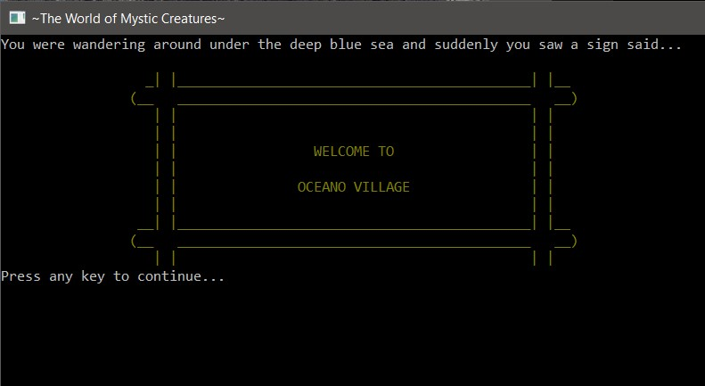

## Portfolio

---

### Sound Design Projects

BEDFELLOWS
  

 
[Short Horror Film: Bedfellows (Music and Sounds by Tien)](https://youtu.be/qjXORN1yXfU)
  
This is my very first sound design project. The music was composed by me using a virtual keyboard. The voice actors were myself, Hayley Tran, and Taichi Kobayashi. It was recorded using Tascam DR-40X portable recorder. The short horror film "Bedfellows" was released in 2009 and directed by Drew Daywalt. It also won the Chiller-Eyegore Award for Best Short Film in 2009. This certainly is not a perfect project, but I really enjoyed working on it.

---
SOULBOT
  

 
[Soulbot (Sounds by Tien)](https://youtu.be/ltQaZAETpzY)
  
"Soulbot" is a sound design project for a commercial video. The music was from Apple Live Loops and was put together on Logic Pro. Most sound effects were collected from freesound.org. The whole project was edited on Pro Tools. The most challenging part while working on this project was that making sure the sound effects of the robots' arms are in sync with the video.

---

### Music Tech Projects
VOICE CHANGER
  

  

---

Mystic Creatures
  

  
Mystic Creatures is a text-based adventure game written in C# coding language. The project demonstrates object-oriented programming principles inheritance, encapsulation, and polymorphism.
In *The World of Mystic Creatures*, you play an anonymous protagonist who accidentally fell off a cruise and got lost in the under-ocean world where there’s people and sea animals live harmoniously. You will face different challenges in order to go back home.

---

Page template forked from <a href="https://github.com/evanca/quick-portfolio">evanca</a>

<!-- Remove above link if you don't want to attibute -->
