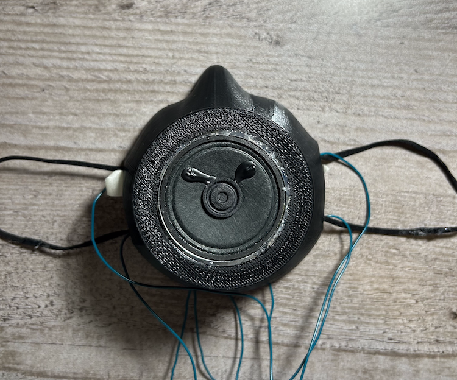

## THE VOICE CHANGER MASK

**Project description:** This is a prototype of a voice changer mask that allows user to change their voice into a robot in real-time. The purpose of the mask is to minimize your real voice so people could hear the modulated voice better. Alternatively, the mask can be redesigned to fit a robot head costume, for example.
 

  
### 1. The mask design

 
The mask was originally designed by Let's Print. It was 3D-printed using MakerBot Replicator Z18, the louspeaker was hot glued to the front, and two rubber bands were attached to the sides. In the picture on the right, you can see there's a piece of wood taped between the speaker and the microphone that's because they were placed too closed to each other which causing feedback.

### 2. The PCB

I designed the PCB based on the data sheet that provided by [Jameco Electronics](https://www.jameco.com/). I used [KiCAD](https://www.kicad.org/) to design the board and ordered it from [JLCPCB](https://jlcpcb.com/). The PCB was sewed to a small wallet, which stored a 9-volt battery. You can clip the wallet on yor belt or waistband.

### 3. Demonstration

[Click here](https://drive.google.com/file/d/1AG7_wzVrepQSZSVkocT2anQ-pAixx95i/view?usp=sharing) to watch the demonstration video.

---
### References

[PCB data sheet](https://www.jameco.com/z/WSAH171-Velleman-Voice-Changer-Solder-Assembly-Kit-Change-Pitch-Add-Vibrato-Effect_2130731.html)
 
[Mask design](https://pinshape.com/items/61146-3d-printed-face-mask-coronavirus) by Let's Print
