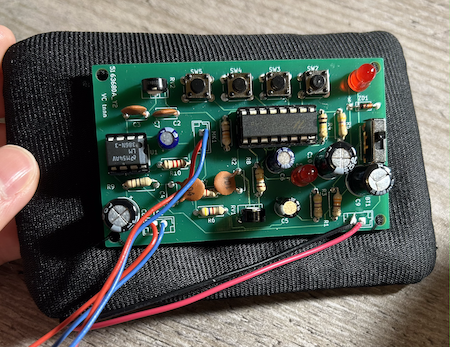

## THE VOICE CHANGER MASK

**Project description:** This is a prototype of a voice-changing mask that enables users to modify their voice into a robotic tone in real-time. The primary purpose of the mask is to minimize the user's original voice, making the modulated voice clearer to others. Additionally, the mask can be redesigned to fit a robot head costume, if desired.
  

  
### 1. The mask design

 
The mask was originally designed by Let's Print. It was 3D-printed using a MakerBot Replicator Z18. A loudspeaker was hot-glued to the front, and two rubber bands were attached to the sides. In the second photo, you can see a piece of wood taped between the speaker and the microphone. This was necessary because they were placed too close to each other, which caused feedback.

### 2. The PCB

 
I created the PCB using the datasheet provided by [Jameco Electronics](https://www.jameco.com/). I utilized [KiCad](https://www.kicad.org/) to design the board and placed an order with [JLCPCB](https://jlcpcb.com/) for manufacturing. The PCB was then sewn into a small wallet that accommodates a 9-volt battery. You can easily clip the wallet onto your belt or waistband for convenience.

### 3. Demonstration

[Click here](https://drive.google.com/file/d/1AG7_wzVrepQSZSVkocT2anQ-pAixx95i/view?usp=sharing) to watch the demonstration video.

---
### References

[PCB data sheet](https://www.jameco.com/z/WSAH171-Velleman-Voice-Changer-Solder-Assembly-Kit-Change-Pitch-Add-Vibrato-Effect_2130731.html)
 
[Mask design](https://pinshape.com/items/61146-3d-printed-face-mask-coronavirus) by Let's Print
